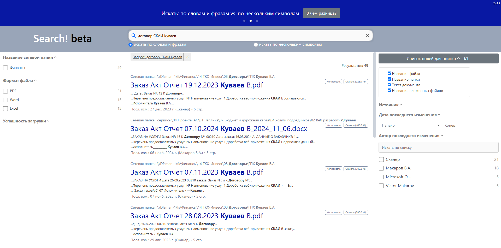

# On-Premises Enterprise Search Solution

[](LICENSE)

A minimum viable product (MVP) for an on-premises enterprise search solution that delivers secure, full-text search capabilities across organizational file storage systems while preserving Active Directory-based access controls.

## Table of Contents

- [Core Functionality](#core-functionality)
- [Technology Stack](#technology-stack)
- [Key Architecture Solutions](#key-architecture-solutions)
- [Getting Started](#getting-started)
- [Pipeline Configuration Reference](#-pipeline-configuration-reference)
- [Technical Debt](#technical-debt)
- [Future Improvements](#future-improvements)
- [Performance and Usage Insights](#performance-and-usage-insights)
- [Contributing](#contributing)

## Demo View



## Core Functionality

- **Web-based application** to search across all file storages and sources
- **Full-text search** capabilities including:
  - File content
  - File and folder names
  - Attached file names
- **Advanced filtering** by:
  - Document type
  - Document author
  - Date of last modification
  - Sources/storages
  - Folder names
- **Active Directory-based access control** for users during search time
- **Direct file access** - open files and folders from original storage or download
- **Single Sign-On (SSO)** user authorization
- **SMB folder ingestion**
- **Multi-format document processing** (docx, doc, xlsx, xls, pptx, ppt, pdf, rtf, txt, jpeg, jpg, png, tiff, and more)
- **Optical Character Recognition (OCR)** for image-based documents

## Technology Stack

### Backend & Processing
- **Python** - Document ingestion and processing
- **Apache Tika Server** - Content extraction from documents
- **Tesseract OCR** - Optical character recognition for image-based documents
- **Elasticsearch 7.14** - Data storage and full-text search engine
- **Node.js** - Web application server
- **MongoDB** - Collects ingestion process logs, user search queries, and login statistics

### Frontend
- **React.js** - Web interface
- **ReactiveSearch** - Core SDK for search functionality
- **Windows URL Protocol Handlers** - Direct user access to files. [Reference: Windows Documentation](https://learn.microsoft.com/en-us/windows/win32/search/-search-3x-wds-ph-install-registration)

### Infrastructure & Security
- **Active Directory integration** (Kerberos)
- **Docker containers** - Web server hosting

## Key Architecture Solutions

### Access Control
Access control is implemented through Active Directory Groups. During ingestion, each file from SMB storage is assigned a list of groups with access permissions based on file system permissions. This list is stored in the database and used as a filter to ensure users can only access documents they have permissions for.

**Benefits:**
- Eliminates the need for separate access management
- Inherits SMB storage permissions, ensuring searchable files are also directly accessible to users
- User permission changes via Active Directory take effect immediately
- File folder permission changes take effect after the next ingestion cycle

**Recommendation:** Design a stable and transparent permission group scheme for SMB folders to minimize frequent adjustments.


### SMB Folder Ingestion Approach
A round-robin ingestion algorithm is used, which recursively scans the entire file folder in an infinite loop. Each file is checked for existence in the database and indexed if absent; otherwise, it is skipped. Simultaneously, another process scans the database and searches for each file on disk by its path—if a file is not found, it is deleted from the database.

### Ingestion Parallelization
To increase throughput and minimize completion time, especially during initial ingestion, the algorithm supports parallel processing, which is particularly beneficial for OCR operations.

**Configuration:**
- Number of threads set in ingestion config files (see [Pipeline Configuration Reference](#-pipeline-configuration-reference))
- Recommended: isolate OCR-requiring documents in separate threads via separate configurations

### Ingested Document Example
See `BackEnd\Elasticsearch\index_document_example.json` for an example of a document structure in the database.

### Index Management
The ingestion configuration allows creation of separate Elasticsearch indexes for different folders, unified by namespace aliases. This approach ensures:
- Better index management
- Improved query performance through parallel scanning

### 🔗 Direct File Access Handler
Browsers are unable to open Microsoft Office documents (such as DOCX, XLSX, and PPTX) or text files directly. To overcome this limitation and provide users with direct access to files, a Windows URL Protocol Handler is utilized. This handler launches Windows Explorer, which in turn triggers the appropriate application to open the selected file.

## Getting Started

### Prerequisites

Before setting up the enterprise search solution, ensure you have:

1. **Active Directory service account** with read permissions to all SMB storage to be ingested (e.g., 'search_orchestrator')
2. **Minimum 2 separate machines:**
   - **Processing machine:** Optimized for CPU cores and RAM for heavy ingestion processes
   - **Web server machine:** Dedicated to hosting the web application
   
   ⚠️ **WARNING:** Using a single machine is not recommended as OCR processes tend to consume all available resources, causing web application downtime.
3. **Docker and Docker Compose installed** - Both back-end and front-end require Docker and Docker Compose
4. **Python installed** - Version 3.9 or higher

### 🔍 Elasticsearch Setup

**Version Compatibility:** This project has been tested with Elasticsearch version 7.14.

##### Step 1: Install Elasticsearch

You can use any Elasticsearch instance. For quick setup, consider using the [official Docker solution](https://www.elastic.co/guide/en/elasticsearch/reference/7.14/docker.html).

**HTTPS MODE** - Ensure your Elasticsearch instance accepts HTTPS requests to guarantee smooth communication with the main web application. You should issue self-signed certificates for Elasticsearch, which will be needed to set up the main web application later.

##### Step 2: Configure Dictionary Files

Ensure your Elasticsearch instance has access to the dictionary files. These dictionary files enhance search functionality and are referenced in the template configuration.

1. Copy the `BackEnd\Elasticsearch\dicts` folder to your Elasticsearch instance

##### Step 3: Create Index Template

The index template defines common properties inherited by all search indexes. Indexes are created automatically during ingestion.

**Important Configuration Notes:**
- Name your indexes in ingestion config files ([see later](#index-and-folder-mapping)) according to the pattern specified in the template's `index_patterns` section (`enterprise_search_folder*`)
- All indexes will be referenced through the alias name specified in the template's `aliases` section (e.g. `enterprise_search`). It should align with the web application [configuration file](#step-4-application-configuration) as ELASTIC.index_alias property.

**To create the template:**

1. Locate the template file: `BackEnd\Elasticsearch\enterprise_search_folder_engine_template.txt`
2. Execute the command from this file against your Elasticsearch instance
3. Verify successful template creation


### 🗄️ MongoDB Setup

**Version Compatibility:** This project has been tested with MongoDB version 5.0.3.

#### Step 1: Install MongoDB

You can use any MongoDB instance. For quick setup, consider using the [official Docker image](https://hub.docker.com/_/mongo).

The configuration file is located at: `BackEnd\MongoDB\docker-compose.yml`

This file provides a simplified setup based on the official MongoDB image version 5.0.3.

#### Step 2: Start MongoDB Container

1. Navigate to the MongoDB directory and launch the container:
   ```bash
   cd BackEnd\MongoDB
   docker-compose up -d
   ```

#### Step 3: Verify Installation

1. Verify the container is running:
  ```bash
  docker ps
  ```

2. Test MongoDB connectivity:
  ```bash
  docker exec -it search-mongo-db mongosh --eval "db.runCommand('ping')"
  ```

#### Result
MongoDB instance is accessible at: `mongodb://localhost:27443`. Use this URL: (1) in ingestion [pipeline config](#-pipeline-configuration-reference) as `Mongo.url` property and (2) in the [web application configuration file](#step-4-application-configuration) as `MONGODB.url` property

### 📄 Apache Tika API Server Setup

This project uses Apache Tika API server deployed via the public Docker image [lexpredict/tika-server](https://hub.docker.com/r/lexpredict/tika-server). For production environments, consider creating your own custom image.

#### Step 1: Configure Tika Settings

1. Navigate to the configuration file: `BackEnd\ApacheTika\tika-config.xml`
2. Configure the following parameters:
   - `port` - API server port
   - `host` - Server host address
   - JVM parameters for memory allocation (e.g., `-Xmx8g -Xms8g` for 8GB max/min heap size). Additional JVM parameters can be configured as needed.

#### Step 2: Start Apache Tika Server

1. Navigate to the Apache Tika directory and launch the container:
   ```bash
   cd BackEnd\ApacheTika
   docker-compose up -d
   ```

#### Step 3: Verify Installation

1. Verify the container is running:
  ```bash
  docker ps
  ```

2. Test Apache Tika API endpoint:
  ```bash
  curl http://localhost:9998/version
  ```

### 👁️ Tesseract OCR Engine Setup

The ingestion engine uses Tesseract OCR through the Python library `pytesseract`, which requires the Tesseract OCR engine to be installed as a system dependency.

#### Windows Installation

1. **Download Tesseract OCR:**
   - Download the installer from the [official releases page](https://github.com/tesseract-ocr/tesseract/releases/download/5.5.0/tesseract-ocr-w64-setup-5.5.0.20241111.exe)
   - Install to the default location (e.g., `C:\Program Files\Tesseract-OCR`)

2. **Add to PATH environment variable:**
   ```powershell
   $env:PATH += ";C:\Program Files\Tesseract-OCR"
   setx PATH "$env:PATH"
   ```

3. **Verify installation:**
   ```powershell
   tesseract --version
   ```

#### Linux Installation

1. **Install Tesseract OCR and language packs:**
   ```bash
   apt-get update
   apt-get install tesseract-ocr -y
   apt-get install tesseract-ocr-all -y
   ```

2. **Verify installation:**
   ```bash
   tesseract --version
   ```

### 🐍 Python Dependencies

**Version Compatibility:** Python 3.9 or higher is required.

#### Step 1: Install Dependencies

Navigate to the backend directory and install the required Python packages:

```bash
cd BackEnd\SMBFolderEngine
pip install -r requirements.txt
```

**Platform-Specific Notes:**
- **Linux users:** Exclude Windows-specific dependencies from the requirements file if installation fails
- **Windows users:** All dependencies in requirements.txt are required

#### Step 2: Verify Installation for pytesseract

Test the installation by running:
```bash
python -c "import pytesseract; print('Dependencies installed successfully')"
```

### 📁 SMB Folder Ingestion

**Version Compatibility:** This project has been tested with Python 3.9.7.

#### Prerequisites

Before starting the ingestion process, ensure the following services are properly configured:

1. [Elasticsearch](#-elasticsearch-setup)
2. [MongoDB](#️-mongodb-setup)
3. [Apache Tika API Server](#-apache-tika-api-server-setup)
4. [Tesseract OCR](#️-tesseract-ocr-engine-setup)
5. [Python Dependencies](#-python-dependencies)

#### Step 1: Directory Setup

Create the required directories for temporary files and logs:

```bash
mkdir BackEnd\SMBFolderEngine\temp
mkdir BackEnd\SMBFolderEngine\logs
```

#### Step 2: Pipeline Configuration

Configure three separate pipeline configurations:

1. **Image-based files pipeline** - Processes image files using OCR in dedicated threads
   - Example: `BackEnd\SMBFolderEngine\pipeline_config\ingest_image_based_example.json`

2. **Non-image files pipeline** - Processes all other document types
   - Example: `BackEnd\SMBFolderEngine\pipeline_config\ingest_non-image_example.json`

3. **Deletion pipeline** - Removes database entries for files deleted from source folders (optional for initial ingestion)
   - Example: `BackEnd\SMBFolderEngine\pipeline_config\deletion_example.json`

For detailed configuration parameters, see [Pipeline Configuration Reference](#-pipeline-configuration-reference).

#### Step 3: Launch Ingestion Process

Execute the following commands **in parallel** to start the ingestion pipelines:

**Image-based files:**
```bash
python "BackEnd\SMBFolderEngine\executable\IndexStarterConsole.py" "BackEnd\SMBFolderEngine\pipeline_config\ingest_image_based_example.json"
```

**Non-image files:**
```bash
python "BackEnd\SMBFolderEngine\executable\IndexStarterConsole.py" "BackEnd\SMBFolderEngine\pipeline_config\ingest_non-image_example.json"
```

**Deletion process (optional for initial ingestion):**
```bash
python "BackEnd\SMBFolderEngine\executable\DeleteStarterConsole.py" "BackEnd\SMBFolderEngine\pipeline_config\deletion_example.json"
```

#### Step 4: Monitor Ingestion Progress

Monitor the ingestion process through log files in the specified `LogDir`:

**Key log files to monitor:**

- **`ApplicationErrors.log`** - Records all process stops (both errors and manual interruptions). Check console for detailed error information.
- **`ElasticSearchError.log`** - Contains errors from Elasticsearch when adding/updating entries. Investigate these errors as they may indicate failed ingestions.
- **`IngestProgressLog.log`** - Shows completion status by file types and folders with the following structure:

| Timestamp | File Type | Folder Name | Cycle Time |
|----------------------|-----------|-----------------------------------------|------------|
| 2025-05-27 03:09:07.953988 | *.docx | \\Dfsman-1\fs\Финансы | 1:33:43.958761 |
| ... | ... | ... | ... |

**Note:** Deletion process status can be monitored via console output as it produces less verbose logging.

#### Step 5: Verify Ingestion Completeness

Once ingestion is complete, verify the results:

**1. Count files in source directories:**

Run this PowerShell script to count files by type in each folder:

```powershell
# Configure your folders and file extensions
$folders = @(
   "C:\Path\To\Folder1",
   "C:\Path\To\Folder2"
)
$extensions = @("pdf", "xlsx", "docx")

$result = @()

foreach ($folder in $folders) {
   foreach ($ext in $extensions) {
      $count = (Get-ChildItem -Path $folder -Filter "*.$ext" -Recurse -File -ErrorAction SilentlyContinue | Measure-Object).Count
      $result += [PSCustomObject]@{
         Folder = $folder
         Extension = $ext
         Count = $count
      }
   }
}

# Display results
$result | Format-Table
```

⚠️ **Note:** This script can be slow for large directories. Consider running it folder by folder for better performance.

**2. Compare with database counts:**

Execute this Elasticsearch query to get indexed document counts:

```json
GET rti_search/_search
{
  "size": 0,
  "aggs": {
    "folder_name": {
      "terms": {
        "field": "folder_name.keyword",
        "size": 1000                  
      },
      "aggs": {
        "file_type": {
          "terms": {
            "field": "format.keyword",
            "size": 100
          },
          "aggs": {
            "unique_docs": {
              "cardinality": {
                "field": "id.keyword"
              }
            }
          }
        }
      }
    }
  }
}
```

**Note:** Large files may be split into multiple separate documents during indexing. To get the actual number of files indexed, refer to the `unique_docs` value in the aggregation results.

Compare the PowerShell script results with the Elasticsearch aggregation results to ensure all files were successfully ingested.

### 🌐 Web Application Setup

**Version Compatibility:** This project has been tested with Node.js 14.17.3

**Browser Support:**
- ✅ **Supported:** Chrome, Edge, Firefox, Yandex Browser
- ❌ **Not Supported:** Internet Explorer, Safari

#### Step 1: Domain Configuration

Configure a domain name that will point to the host machine where the web application will be deployed.

#### Step 2: SSL Certificate Setup

**1. Web Application SSL Certificates**

Prepare SSL certificates for your domain and copy them to the `FrontEnd\WebServer\ssl` folder with the following names:
- `fullchain.crt` - Full certificate chain
- `cert.key` - Private key

This folder will be mounted to the Docker container's `/etc/ssl` directory.

**2. Elasticsearch SSL Certificates**

Copy the Elasticsearch self-signed certificates (created during [Elasticsearch setup](#-elasticsearch-setup)) to the same `FrontEnd\WebServer\ssl` folder with these specific names:
- `elastic_cert.crt`
- `elastic_cert.key`
- `elastic_cert.ca`

#### Step 3: Kerberos Configuration

Configure Kerberos authentication by creating two required files:
- `krb5.conf` - Kerberos configuration
- `krb5.keytab` - Kerberos key table

Copy both files to the `FrontEnd\WebServer\config` folder. These files will be mounted to the container's `/etc` directory via docker-compose.yaml.

#### Step 4: Application Configuration

Create the main configuration file containing server secrets and connection parameters.

**Location:** `FrontEnd\WebServer\config\config.yaml`

**Configuration Reference:**

| Parameter | Type | Required | Description | Example |
|-----------|------|----------|-------------|---------|
| `DOMAIN` | String | ✅ | Domain name from Step 1 | `search.your-domain.com` |
| `AD.baseDN` | String | ✅ | Active Directory base Distinguished Name | `dc=domain,dc=com` |
| `AD.url` | String | ✅ | Active Directory server URL with port | `ldap://addc-2.domain.com:389` |
| `AD.username` | String | ✅ | Service account for AD authentication | `search_orchestrator@domain.com` |
| `AD.password` | String | ✅ | Service account password | `password` |
| `MONGODB.url` | String | ✅ | MongoDB connection URL with port | `mongodb://localhost:27443` |
| `ELASTIC.address` | String | ✅ | Elasticsearch host and port | `localhost:9200` |
| `ELASTIC.username` | String | ✅ | Elasticsearch username | `elastic` |
| `ELASTIC.password` | String | ✅ | Elasticsearch password | `password` |
| `ELASTIC.protocol` | String | ✅ | Connection protocol | `https` |
| `ELASTIC.index_alias` | String | ✅ | Index alias from [index template](#step-3-create-index-template) | `enterprise_search` |

Use the template file at `FrontEnd\WebServer\config\config.yaml` as a reference.

#### Step 5: Development Environment Testing

Test your configuration by running the server locally before containerization.

**Prerequisites:**
- Node.js and npm installed

**Installation and startup:**
```bash
cd FrontEnd\WebServer
npm install
npm start
```

**Verification:**
Open your browser and test the application functionality.

#### Step 6: Docker Image Preparation

**1. Configure Kerberos in Dockerfile**

Edit `FrontEnd\WebServer\Dockerfile` and locate the line responsible for creating `/etc/krb5.conf`. Adjust the configuration according to your domain properties - this file is essential for Kerberos package installation and setup.

**2. Build Docker Image**

```bash
cd FrontEnd\WebServer
docker build --no-cache -t your-repository/srchapp:latest .
```

#### Step 7: Docker Compose Configuration

**1. Configure docker-compose.yml**

Edit `FrontEnd\WebServer\docker-compose.yml` with the following parameters:

**Core Settings:**
- **image:** Use the Docker image created in Step 6
- **command:** Bash command that starts the server
- **ports:** Configure output port (consider reverse proxy for custom ports)

**Environment Variables:**
- **NODE_ENV:** Set to `production` for production features (session cookies, etc.). Any other value defaults to development mode
- **MONGO_DB:** Database name for web application logs

**Volume Mounts:**
- **Config:** `FrontEnd\WebServer\config` → `/config` (application configuration access)
- **SSL:** `FrontEnd\WebServer\ssl` → `/etc/ssl` (SSL certificate access)
- **Kerberos:** Mount `krb5.conf` and `krb5.keytab` to `/etc` directory
- **SMB Sources:** Mount all source SMB folders to enable file download functionality. Container paths must match external paths exactly for proper file access. Reference the volumes section in `FrontEnd\WebServer\docker-compose.yml` for SMB mount examples. Use `.env` to store secrets. **Note:** Use IP addresses instead of domain names for SMB mounting to avoid connectivity issues.

#### Step 8: Deploy Application

Launch the containerized application:

```bash
cd FrontEnd\WebServer
docker-compose up -d
```

#### Step 9: Deployment Verification

**1. Container Status Check**
```bash
docker-compose ps
```

**2. Application Logs Review**
```bash
docker logs srchapps-prod
```

**Expected Log Output (Successful Startup):**
```
2025-05-27T19:50:16.288Z General app config uploaded from /config/config.yaml
2025-05-27T19:50:16.288Z SSL cert uploaded from /etc/ssl/fullchain.crt
2025-05-27T19:50:16.288Z SSL key uploaded from /etc/ssl/cert.key
2025-05-27T19:50:16.288Z SSL elastic cert uploaded from /etc/ssl/elastic_cert.crt
2025-05-27T19:50:16.288Z SSL elastic key uploaded from /etc/ssl/elastic_cert.key
2025-05-27T19:50:16.288Z SSL elastic CA uploaded from /etc/ssl/elastic_cert.ca
Current OS = linux
[HPM] Proxy created: /  -> https://localhost:9200
[HPM] Proxy rewrite rule created: "^/elasticsearch" ~> "/rti_search"
Access this application at https://search.domain.ru
```

**3. Container Environment Verification**
```bash
docker exec -it srchapps-prod bash
```

Inside the container, verify:
- Accessibility of mounted source SMB folders
- Presence of files in `/config`, `/etc` and `/etc/ssl` directories

**4. Functionality Testing**
- Access application via browser using your domain
- Test file download feature to ensure proper [SMB folder mounting](#step-7-docker-compose-configuration)
- Verify search functionality and user authentication

### 🔗 Windows URL Protocol Handler

The Windows URL Protocol Handler enables users to directly access files and folders using their native applications (MS Word, MS Excel, etc.) by handling special URLs from the web interface.

**System Requirements:**
- Windows operating system only (utilizes built-in Windows functionality)
- Administrative privileges for installation

**Installation Process:**

1. **Deploy the handler executable:**
   ```
   Copy: FrontEnd\WindowsURLProtocolHandler\WindowsExplorerHandler.exe
   To: C:\Search\WindowsExplorerHandler.exe
   ```

2. **Register the protocol handler:**
   ```
   Run: FrontEnd\WindowsURLProtocolHandler\explorer_reff.reg
   ```
   This registers the handler in the Windows Registry to process `explorerreff://` URLs.

**Deployment Options:**
- **Individual installation:** Manual setup on each user's workstation
- **Enterprise deployment:** Deploy via Group Policy or other corporate deployment tools

**Customization:**
- To change the handler executable location, edit the path in `explorer_reff.reg` before registration
- Ensure the registry path matches your chosen installation directory


## 🔧 Pipeline Configuration Reference

This section provides comprehensive documentation for configuring SMB folder ingestion pipelines. Pipeline configurations are JSON files that control document ingestion and deletion processes.

### Ingestion Pipeline Configuration

Ingestion pipelines process files from SMB storage and index them into Elasticsearch. Two configuration types handle different processing requirements:

#### Core Parameters

| Parameter | Type | Required | Description | Example |
|-----------|------|----------|-------------|----------------|
| `file_types` | Array | ✅ | File extensions to process from source folders | `["*.pdf", "*.docx", "*.jpg"]` |
| `file_category` | String | ✅ | Processing category for thread allocation | `"image"`, `"other"` |
| `Source` | String | ✅ | Data source description displayed in user interface | `"Сетевая папка"` |
| `Multithred` | Boolean | ✅ | Enable/disable multi-threaded processing | `true`, `false` |
| `AppType` | String | ✅ | Processing mode (use `"Index"` — `"Update"` is reserved for future event-driven ingestion) | `"Index"` |

#### Service Connection Parameters

| Parameter | Type | Required | Description | Example |
|-----------|------|----------|-------------|-----------------|
| `Mongo` | Object | ✅ | MongoDB connection configuration | See below |
| `Mongo.url` | String | ✅ | MongoDB connection URL | `"mongodb://localhost:27443"` |
| `Mongo.db` | String | ✅ | MongoDB database name | `"srch_indexing"` |
| `Tika` | String | ✅ | Apache Tika API server URL | `"http://localhost:9998"` |

#### Directory Configuration

| Parameter | Type | Required | Description | Example |
|-----------|------|----------|-------------|-------------------|
| `LogDir` | String | ✅ | Relative path for log file storage | `"BackEnd\\SMBFolderEngine\\logs"` |
| `TempDir` | String | ✅ | Relative path for temporary processing files | `"BackEnd\\SMBFolderEngine\\temp"` |
| `homePath` | String | ✅ | Base path for resolving relative directories | `"BackEnd\\SMBFolderEngine"` |

#### Index and Folder Mapping

| Parameter | Type | Required | Description |
|-----------|------|----------|-------------|
| `IndexPairs` | Array | ✅ | Maps Elasticsearch indexes to folder paths |

Each `IndexPairs` entry structure:
```json
{
  "index_name": {
    "folderName": "Human-readable folder description",
    "path": ["\\\\server\\share\\folder1", "\\\\server\\share\\folder2"]
  }
}
```

**Key Points:**
- **index_name**: Auto-created if non-existent, inheriting properties from the [index template](#step-3-create-index-template)
- **folderName**: Display name shown in user interface source filters
- **path**: Multiple paths can be unified under one index and folder name

**Ingestion Sequence**: Processing occurs sequentially—each IndexPair processes all file types before moving to the next IndexPair.

#### Multithreading Configuration

| Parameter | Type | Required | Description | Example |
|-----------|------|----------|-------------|-------------------|
| `MaxThreadLoad` | Array | ✅ | Memory usage thresholds (decimal values) | `[0.8, 0.945]` |
| `MaxThreads` | Array | ✅ | Maximum threads per memory level | `[4, 2, 1]`|

**Thread Management Logic:**
`MaxThreadLoad` and `MaxThreads` arrays work together to dynamically adjust thread allocation based on available RAM:

Using example values `[0.8, 0.945]` and `[4, 2, 1]`:
- Memory usage < 80%: Use up to 4 threads
- Memory usage 80%-94.5%: Use up to 2 threads  
- Memory usage > 94.5%: Use 1 thread only

### Deletion Pipeline Configuration

Deletion pipelines maintain data integrity by removing Elasticsearch entries for files that no longer exist in the source folders.

#### Parameters

| Parameter | Type | Required | Description | Example |
|-----------|------|----------|-------------|---------|
| `Indexes` | Array | ✅ | Elasticsearch index names to clean | `["enterprise_search_folder_finance", "enterprise_search_folder_hr"]` |

### Configuration Best Practices

#### Performance Optimization

**1. Separate Processing Categories**
- Use distinct configurations for OCR-intensive files versus text extraction
- Isolate resource-heavy operations to prevent performance bottlenecks

**2. Thread Allocation Strategy**
- **Image processing**: Start with 2 threads minimum, scale based on available RAM/CPU
- **Non-image processing**: Single-threaded approach recommended for stability (Multithred = false)

#### File Type Categorization

**Image Category (OCR-intensive):**
`*.pdf`, `*.jpg`, `*.jpeg`, `*.png`, `*.tiff`, `*.tif`, `*.bmp`, `*.gif`

**Non-image Category (text extraction):**
`*.docx`, `*.doc`, `*.xlsx`, `*.xls`, `*.pptx`, `*.ppt`, `*.txt`, `*.rtf`, `*.json`, `*.js`

#### Index Organization Strategy

- **Logical separation**: Create indexes by organizational units or data sources
- **Naming consistency**: Use descriptive names matching index template patterns
- **Maintenance coverage**: Include all indexes in deletion configurations for proper cleanup


## Technical Debt

The following issues need to be addressed:

- [ ] Fix bug in Windows URL Protocol Handler that prevents some files from being accessed directly
- [ ] Python code quality review and improvement with unit and integration test coverage
- [ ] Front-end code quality review and improvement with unit and integration test coverage  
- [ ] Implement a more consistent logging approach with all logs collected in the database

## Future Improvements

### User Experience
- [ ] Enhance UX by improving web application layout
- [ ] Transition UI to Electron framework to eliminate Windows Handler requirement
- [ ] Improve search performance
- [ ] Add filter by main document language

### Support and Maintenance
- [ ] Add user form authorization
- [ ] Consider upgrading Elasticsearch to the latest stable version or migration to OpenSearch (open-source Elasticsearch alternative)
- [ ] Simplify the project stack by eliminating MongoDB and transferring functionality to Elasticsearch

### Ingestion & Processing
- [ ] Add archive file ingestion (e.g. zip, rar, tgz)
- [ ] Add more ingestion engines:
  - Corporate mail
  - Corporate chats
  - SharePoint
  - etc
- [ ] Improve SMB folder ingestion engine (move from round-robin to source events handling)
- [ ] Migrate ingestion process orchestration to Apache Airflow
- [ ] Improve OCR of low quality images: Consider Google Document AI as Tesseract alternative, purchase ABBYY FineReader SDK, or enhance Tesseract performance through additional training

## Performance and Usage Insights

### Storage Requirements

To plan Elasticsearch index sizing based on the total size of indexed folders, refer to the following performance metrics:

| Source Folder Size (GB) | Files in Folder | Index Size (GB) | Files in Index | Storage Ratio | File Processing Ratio |
|-------------------------|-----------------|-----------------|----------------|---------------|----------------------|
| 503                     | 197,002         | 4               | 137,153        | 125:1         | 70%               |
| 153                     | 42,622          | 0.63            | 35,412         | 242:1         | 83%               |

**Key Insights:**
- **Storage efficiency**: Elasticsearch indexes are approximately 125x - 242x smaller than source folders
- **File processing**: Roughly 70% - 83% of files are successfully indexed (remaining files may be unsupported formats or corrupted)

### Ingestion Throughput

Use these performance benchmarks to estimate initial and ongoing ingestion timelines:

The following analysis is based on a test folder containing 153 GB and 42,622 files:

| Processing Type | File Size (GB) | Share of Total | Files Processed | Duration (Hours) | Speed (GB/hour) | Speed (Files/hour) |
|----------------|----------------|----------------|-----------------|------------------|-----------------|-------------------|
| **Initial image ingestion** [1] | 42.24 | 27.6% | 30,433 | TBA | 0.32 | 238 |
| **Initial non-image ingestion** [2] | 4.7 | 3.0% | 4,649 | 7.8 | 0.6 | 594 |
| **Updates (all file types)** | 153.0 | 100% | 42,622 | 0.38 | 402 | 112,163 |

**File Type Categories:**
- [1] **Image files:** pdf, bmp, gif, png, jpg, jpeg, tif, tiff
- [2] **Non-image files:** docx, doc, pptx, ppt, xlsx, xls, xlsm, xlsb, rtf, txt, json, js

#### Forecasting Initial Ingestion Duration

To estimate ingestion time for your environment, consider these key factors:

- **Use folder size** rather than file count, as ingestion duration heavily depends on file size
- **Focus on target file types** rather than total folder size, since many files in the folder may be outside the ingestion scope
- **To simplify calculation** focus on the following file types as they represent 80%+ of typical indexing workload: pdf, tif, jpg, png, docx, doc, pptx, ppt, xlsx, xls

**Performance Variables:**
- Hardware specifications (CPU cores, RAM, storage type)
- Network bandwidth to source folders
- File size distribution and complexity
- OCR processing requirements for image-based documents

### User Search Patterns

For representative search query examples, see `Other\UserSearchQueries.txt`. This file contains anonymized search queries from a small user group (up to 5 people) collected from January 2023 to February 2025, providing insights into:


## Contributing

We welcome contributions! Please read our contributing guidelines and submit pull requests for any improvements.

## License

This project is licensed under the MIT License - see the [LICENSE](LICENSE) file for details.
